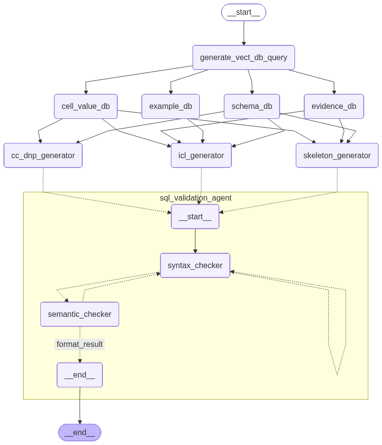

# Text2SQL

**Project Overview**
- **Purpose**: Implement a Text-to-SQL pipeline that decomposes user questions, retrieves grounding information from vector DBs, and generates/validates executable SQL queries.
- **Primary components**: retrieval (vector DB), multiple SQL generators, and a SQL validation agent.

**Repository Structure**
- **`models.py`**: LLM and vector DB client configuration.
- **`prompts.py`**: System and user prompt templates used by the LLMs.
- **`states.py`**: Typed state definitions for agents and merge rules.
- **`text2sql.py`**: Main workflow graph that wires retrieval, generation, and validation nodes.
- **`sql_validation_agent.py`**: Subgraph that runs `syntax_checker` and `semantic_checker` loops.
- **`test.py`**: Small runner that can generate a `text2sql_agent.png` diagram and invoke the workflow.
- **`chroma_db_store/`**: Persistent Chroma DB storage with collections used for grounding.

**Multi-Agent Architecture**
- **Overview**: The system builds retrieval queries from the user question, retrieves schema/evidence/values/examples from vector stores, then runs up to three parallel SQL generation strategies (skeleton-based, in-context learning, clause-by-clause). Each generated SQL candidate is validated by the `sql_validation_agent` which runs syntax checks and a semantic audit.

**Runtime notes & token limits**
- The `semantic_checker` uses the `llm` from `models.py` (by default set to `openai/gpt-oss-120b` in this workspace). That model and your API plan have a tokens-per-minute (TPM) limit; running multiple generation branches in parallel (and having large prompts / long `full_context`) can exceed that limit and produce 429 rate-limit errors.
- Short-term mitigations:
  - Reduce parallel fan-out in `text2sql.py` so only one generator runs per request.
  - Use a smaller/cheaper model for semantic checks in `models.py`.
  - Trim `full_context` passed into semantic prompts (`prompts.py`) to fewer lines.
  
**Contributing**
- Run the workflow locally via `python test.py` and inspect the saved diagram.
- Please open issues for edge cases (e.g., inconsistent state types) and include the traceback and input question.

**License & Credits**
- Project created for a Master-level Text2SQL research exercise. Reuse and modification are allowed for research and educational purposes.
